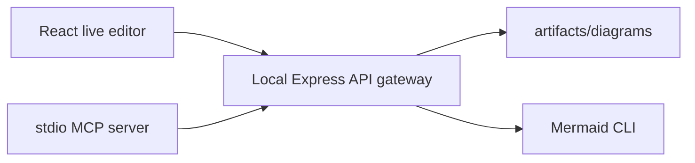

# Mermaid Studio Local Architecture

## Decision

Use one local application with three deliberately narrow layers:

- The browser renders quickly with Mermaid and exports the visible SVG to a transparent 4× PNG.
- The Express gateway is the only writer to `artifacts/diagrams`; it validates input and saves `.png`, `.mmd`, `.svg` (for browser exports), and metadata together.
- The MCP server uses the gateway, not the browser DOM or direct filesystem writes. Its create tool uses Mermaid CLI so it can make a high-resolution transparent PNG with no open browser window.

## Product boundaries

All Mermaid diagram types render live. The optional freeform editor is intentionally narrower: it supports standard flowcharts with named nodes and arrows. It can move boxes, keep attached arrows connected, and bend arrows using handles. Other Mermaid layouts are owned by Mermaid's renderer and remain exportable, but are not exposed as unreliable draggable geometry.

## Performance and UX choices

- Rendering is debounced by 260 ms, keeping keystrokes responsive.
- No network API is required for preview, local history, library, SVG export, or browser PNG export.
- The UI editor is dormant until **Edit layout** is selected. It only adds drag listeners and SVG overlays in that mode.
- The API binds to `127.0.0.1`; remote callers cannot write arbitrary paths. Artifact filenames are generated internally from a sanitized title plus a UUID.

## Known operational requirement

The first MCP creation invokes Mermaid CLI's headless browser renderer. If Chromium has not been installed by the package manager, run `npx mmdc -h` once in the project and follow its browser-install guidance. Browser-originated exports do not have this requirement.
